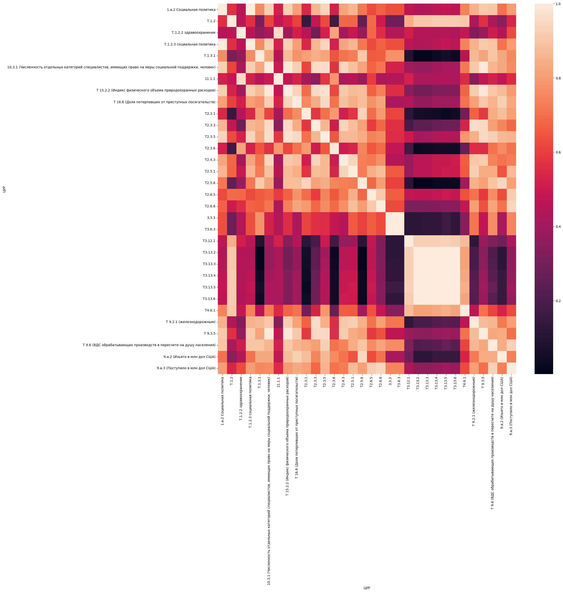
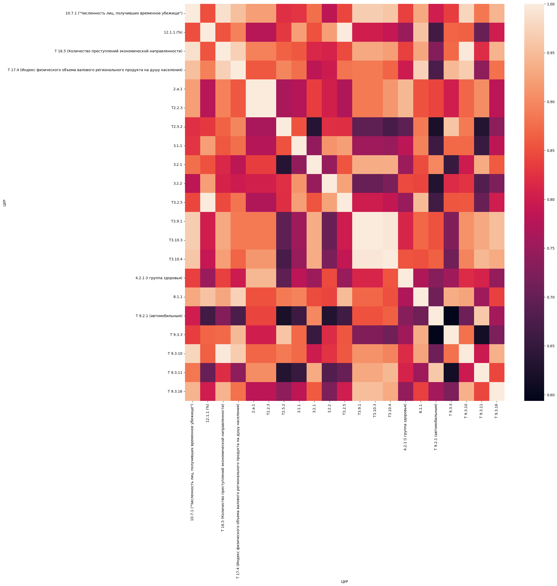
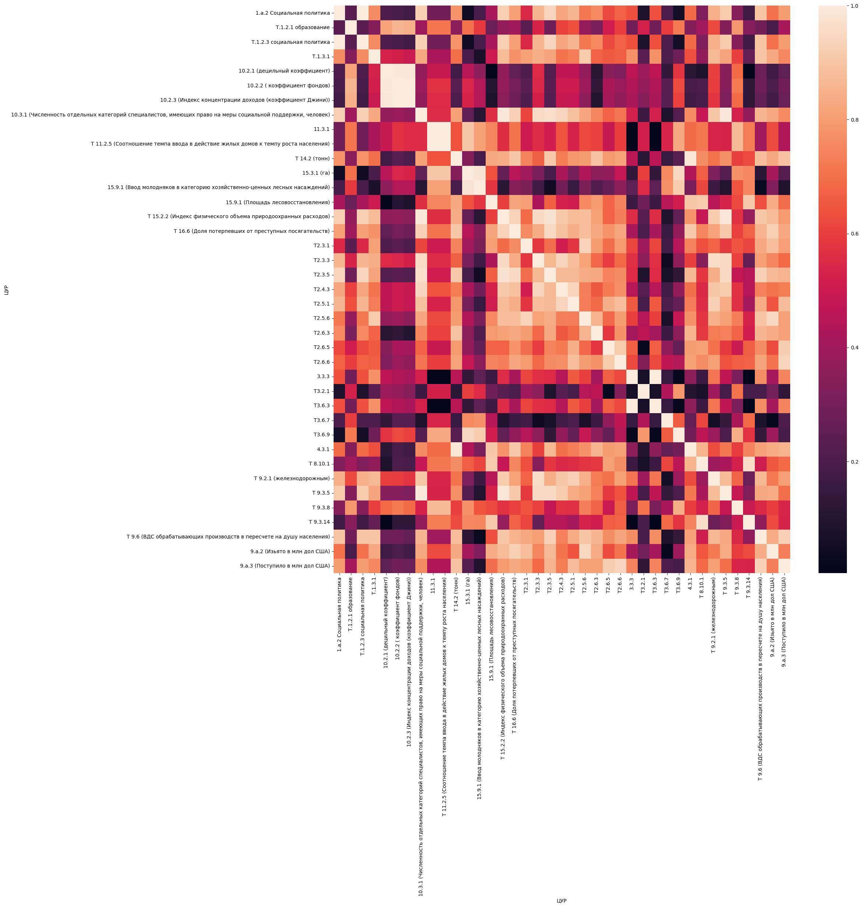

### Кластеризация

Agglomerative clustering

Kmeans clustering

### Корреляции в кластерах

Agglomerative clustering 1

Agglomerative clustering 2

Agglomerative clustering 3

Agglomerative clustering 4

Agglomerative clustering 5

Kmeans clustering 1

Kmeans clustering 2

Kmeans clustering 3

Kmeans clustering 4

Kmeans clustering 5

